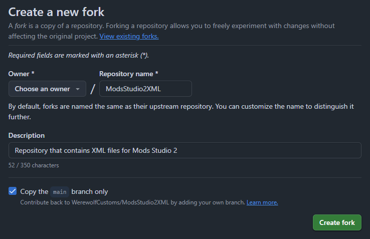
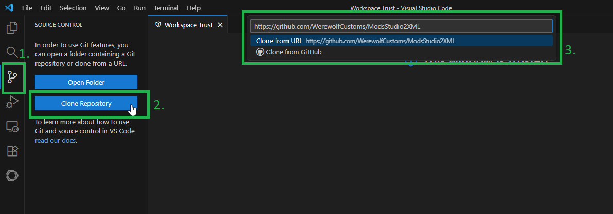
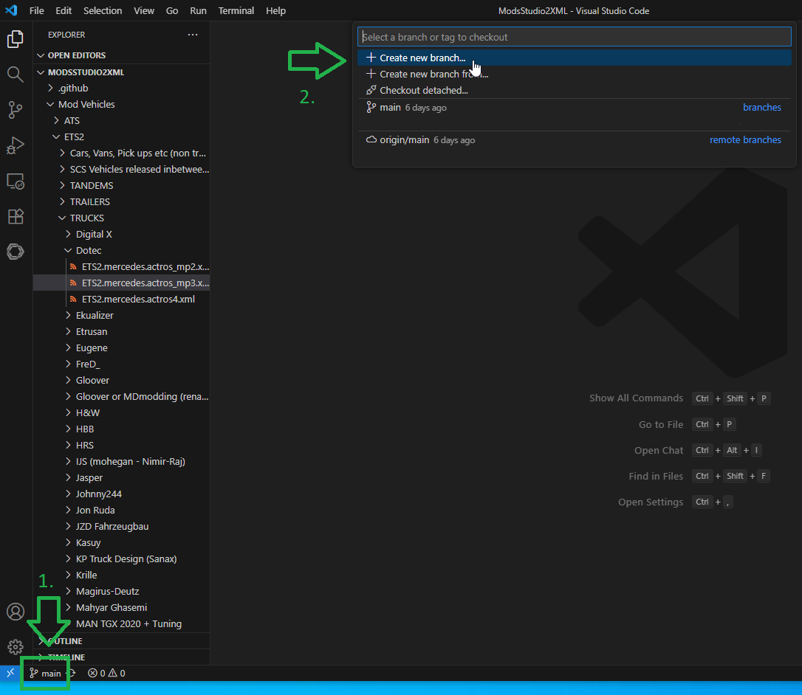
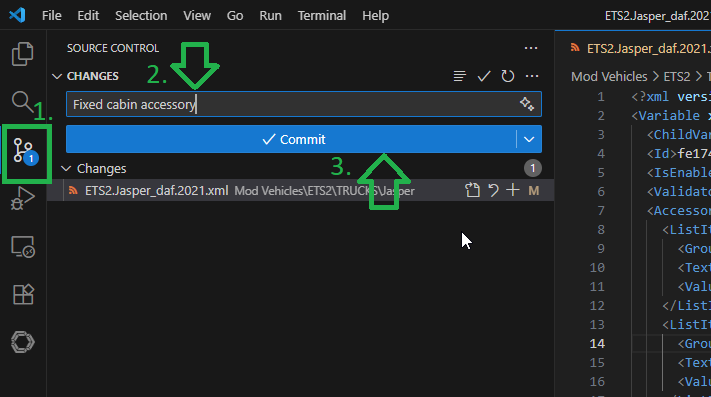

# ModsStudio2XML
Repository that contains XML files for Mods Studio 2

# How to Contribute to this XML Repository

Simple, step-by-step guide for contributors using Visual Studio Code (VS Code).

---

## You'll need...
- a free GitHub account 
- VS Code installed: https://code.visualstudio.com  

---

## Step 1 — Create a GitHub account
Sign up or sign in at [https://github.com](https://github.com).  

---

## Step 2 — Fork the repository
Create your own copy of the repo.

1. Open [https://github.com/WerewolfCustoms/ModsStudio2XML/](https://github.com/WerewolfCustoms/ModsStudio2XML/) in your browser.  
2. Click **Fork** → **Create fork**.  

You now have your own version at:  
`https://github.com/YOUR_GITHUB_USERNAME/ModsStudio2XML`

---

## Step 3 — Clone your fork to your computer (with VS Code)
Get the files locally.

1. Open VS Code  
2. Press `F1` → type `Git: Clone` → Enter
3. Paste your fork URL:  
   `https://github.com/YOUR_GITHUB_USERNAME/ModsStudio2XML.git`  
4. Choose a local folder  
5. When asked, click **Open** to open the cloned folder  

---

## Step 4 — Create a new branch in VS Code
Create a local branch where you can work on your changes.

1. Click the branch name in the blue status bar (bottom-left)  
2. Click **Create new branch**  
3. Name it clearly, e.g. `fix-typo-in-truck-xml` or `add-new-trailer`  

---

## Step 5 — Edit XML files in VS Code
Make your changes.  
- Open the XML file from the Explorer panel  
- Keep formatting consistent  
- Make small, focused changes per branch  
- Save with `Ctrl+S`

---

## Step 6 — Commit your changes
Save a snapshot of your work.  

1. Click the **Source Control** icon (left sidebar)  
2. Enter a short message, e.g. `Fix wheel size in vehicle.xml`  
3. Click **Commit** (✓)  

---

## Step 7 — Push your branch to your fork
Send your branch to GitHub.  
1. In the **Source Control** view, click **Publish Branch** or **Push**  
2. If prompted, sign in to GitHub  

Your branch appears at:  
`https://github.com/YOUR_GITHUB_USERNAME/ModsStudio2XML/tree/BRANCH_NAME`

---

## Step 8 — Open a Pull Request (PR)
Ask to merge your changes into the main repo.  
1. Go to your fork on GitHub  
2. Click **Compare & pull request**  
3. Target the **WerewolfCustoms/ModsStudio2XML** repository’s `main` branch  
4. Write a clear title and short description  
5. Click **Create pull request**  